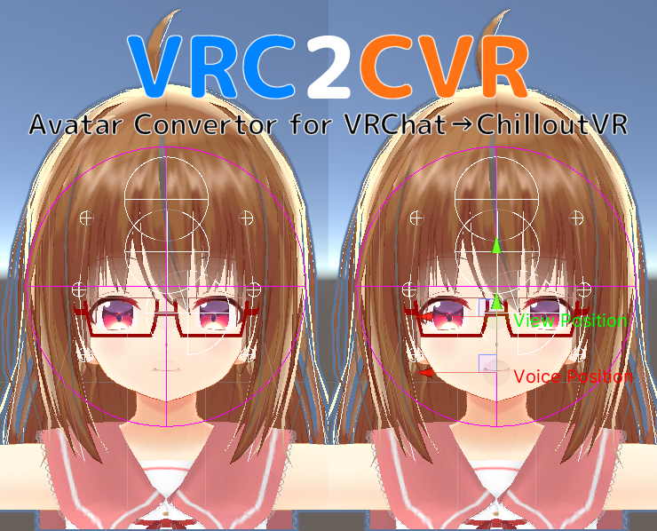
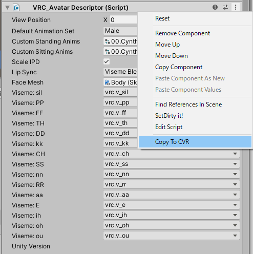

# VRC2CVR

Avatar convertor : VRChat(VRCSDK2) avatar to ChilloutVR avatar

## Usage

1. Copy your vrchat avatar project
2. Open the copied project by Unity 2019
3. Import CCK(ChilloutVR SDK)
4. Import VRC2CVR
5. Open avatar scene and do below!

## Caution!

The author of this tool does not fully understand VRChat's "AnimationOverride", so there may be mistakes in the conversion of override. Pull requests are welcome!
## License

[Zlib](LICENSE)
